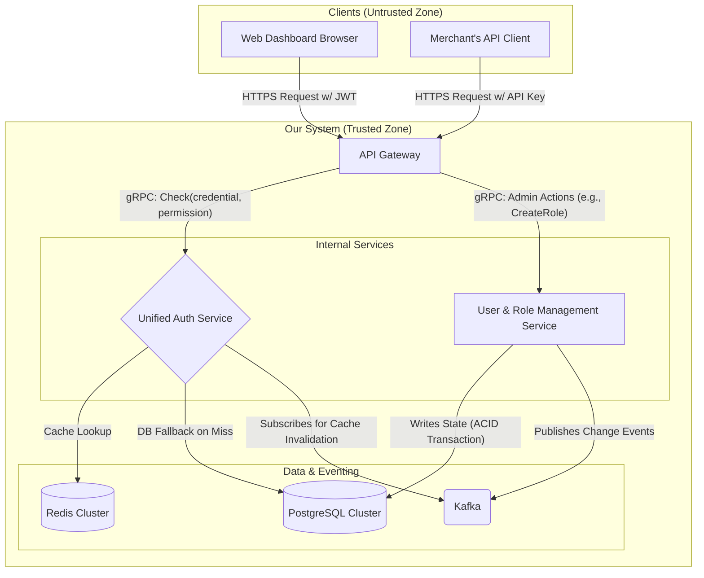
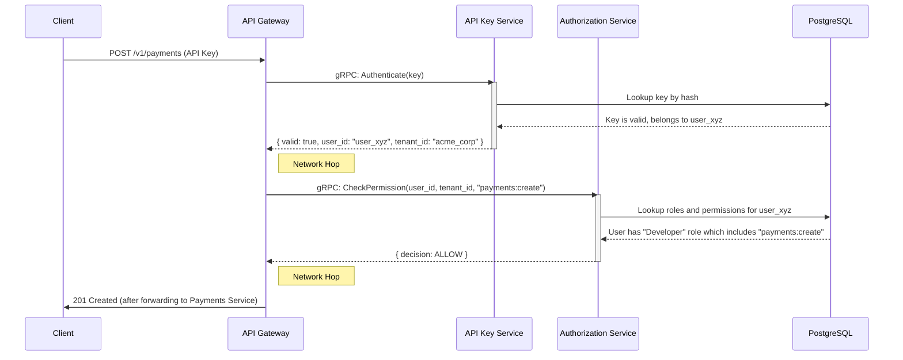
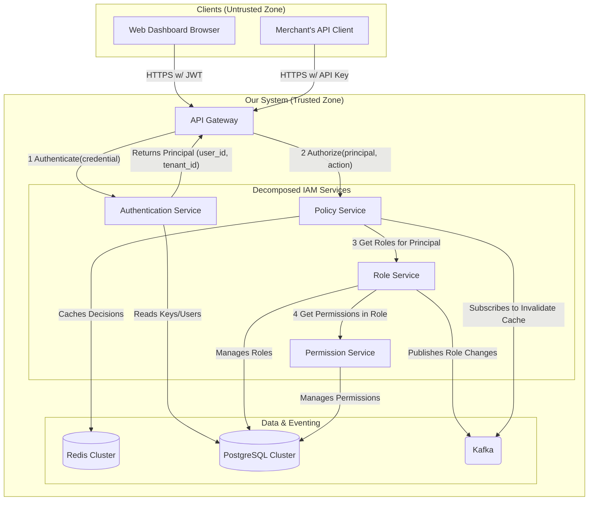
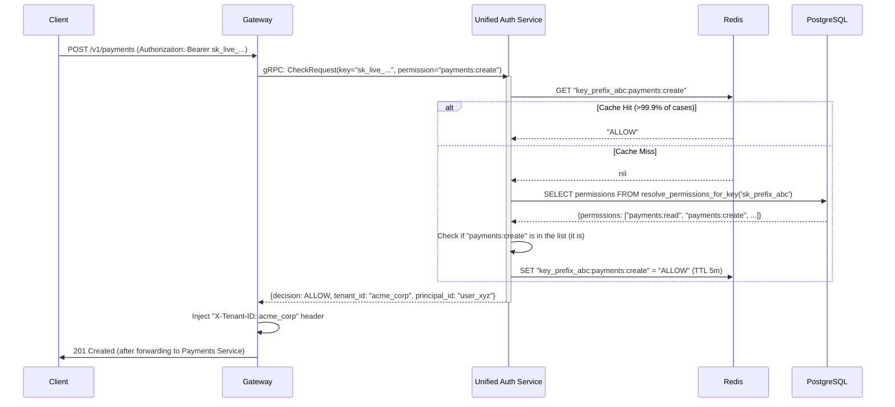
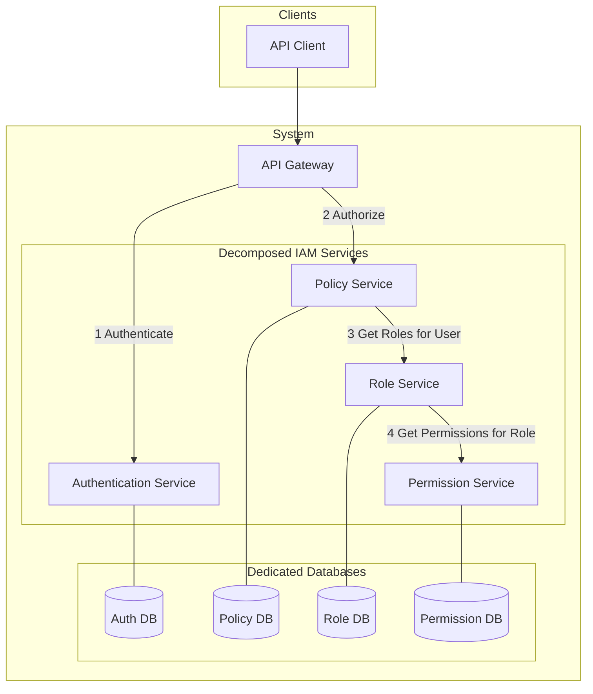
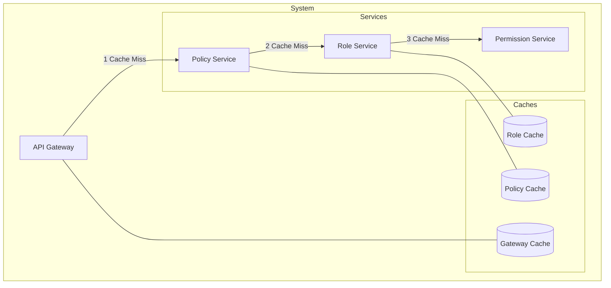

### **1. Introduction & Guiding Principles**

This document specifies the design for a foundational Identity and Access Management (IAM) system. This system will serve as the central authority for authentication and authorization for a multi-tenant SaaS platform, handling both human users and programmatic machine clients. It is a Tier-0 service; its failure or compromise represents a catastrophic failure for the entire platform.

The design is guided by the following core principles, in order of priority:

1. **Security First:** The system must be secure by default. Every decision must be evaluated through the lens of potential security vulnerabilities, from data storage to API design. Correctness and security will always be chosen over simplicity or performance.
2. **Performance at Scale:** The authorization path is in the critical path of every single API request. The system must deliver low-latency decisions at massive scale, ensuring it is a performance enabler, not a bottleneck.
3. **High Availability:** As a Tier-0 service, the system must be exceptionally resilient. It will be designed with no single points of failure, supporting graceful degradation and rapid recovery.
4. **Operability:** The system must be maintainable, monitorable, and debuggable. We will design for operational excellence from day one, including structured logging, detailed metrics, and a clear deployment strategy.

---

### **2. Core Concepts & Entities**

Before detailing the architecture, we must define the vocabulary of our domain. These entities are the fundamental building blocks of our access control model.

- **Principal:** The abstract term for any entity that can be authenticated and perform an action. This is the "who" in an access control decision. In our system, principals can be **Users** or **API Keys**.
- **Tenant:** A Tenant represents a single customer organization. It is the highest-level container for data and forms a strict, non-negotiable isolation boundary. All resources, roles, and permissions are scoped to a single Tenant. For example, `acme-corp` and `beta-inc` are two separate Tenants.
- **User:** A global entity representing a single human identity, typically identified by an email address. A User's identity is portable, meaning the same User can be a member of multiple Tenants, holding different Roles in each.
- **Role:** A named collection of Permissions within a specific Tenant. Roles are a powerful abstraction for simplifying access management. Instead of assigning hundreds of individual permissions to a user, an administrator assigns a Role like "Administrator," "Developer," or "Auditor."
- **Permission:** The most granular unit of control, representing a single, specific action on a resource. We will use a standard format: `resource:action` (e.g., `payments:create`, `invoices:read`). This structure is simple, scalable, and easy to reason about.
- **API Key:** A long-lived credential used by a machine Principal for programmatic, server-to-server access. Each API Key is associated with a User and scoped to a single Tenant. It has a public prefix for identification (e.g., `sk_live_...`) and a secret token. The secret is hashed using a strong, slow algorithm like **Argon2** and never stored in plaintext.

---

### **3. Requirements & Scale Estimation**

### **Functional Requirements**

- **Multi-Tenant RBAC:** Admins within a Tenant can create custom Roles and assign them to Users.
- **API Key Management:** Users can generate, revoke, and manage scoped API Keys.
- **User Authentication:** Users can log in to a web dashboard via email/password, receiving a short-lived JWT.

### **Non-Functional Requirements**

- **Latency:** p99 authorization checks (the hot path) must be **< 50ms**. p99 for management API calls (the cold path) can be < 500ms.
- **Availability:** **99.99%** uptime for the `Auth Service`.
- **Consistency:** Permission changes must propagate and be enforced globally in **< 1 second**.
- **Durability:** No audit event or permission change may ever be lost (RPO of 0).
- **Compliance:** The system must produce an immutable audit trail for all sensitive actions to comply with regulations like SOC 2 and GDPR.
- **Scale:**
  - **Read QPS:** 100,000+ authorization checks per second.
  - **Write QPS:** ~1-10 permission changes per second.
  - **Read/Write Ratio:** ~100,000:1.
  - **Data Size:** Millions of Tenants, tens of millions of Users, billions of permission records.

---

### **4. High-Level Architecture**

The architecture is a microservices system optimized for the extreme read/write asymmetry. A high-performance, unified `Auth Service` handles the read-heavy critical path, while a separate `Management Service` handles the low-traffic write path.

Code snippet

#

---

### **5. Component Deep Dive**

This section details the responsibilities and internal structure of each component.

### **API Gateway**

- **Responsibility:** The sole entry point to our system, acting as the **Policy Enforcement Point (PEP)**. Its primary responsibilities are:
  1. **TLS Termination:** Decrypting incoming HTTPS traffic.
  2. **Request Validation:** Rejecting malformed requests (e.g., invalid JSON) before they consume backend resources.
  3. **Credential Extraction:** Parsing the `Authorization` header to extract the API Key or JWT.
  4. **Authentication/Authorization Call:** Making a single, blocking gRPC call to the `Unified Auth Service` to validate the request.
  5. **Tenant Context Injection:** Upon receiving an `ALLOW` response, it injects the `tenant_id` from the token into a request header (e.g., `X-Tenant-ID`) for downstream services.
  6. **Rate Limiting:** Applying global and per-tenant rate limits using an algorithm like the token bucket.
- **Technology:** A high-performance proxy like Nginx or Envoy, or a cloud-native solution like an AWS Application Load Balancer with Lambda authorizers.

### **Unified Auth Service**

- **Responsibility:** The high-performance core of the IAM system, acting as the **Policy Decision Point (PDP)**. It is designed to be stateless, horizontally scalable, and optimized for low-latency reads. It answers one question: "Is this Principal allowed to perform this Action?"
- **Internal Structure:** It is a single microservice but contains logically separate modules:
  - **Authenticator Module:** Handles the mechanics of validating different credential types. For a JWT, it cryptographically verifies the signature using a public key. For an API Key, it hashes the provided secret and compares it to the hash stored in the database (on a cache miss).
  - **Authorizer Module:** Takes the validated identity (e.g., `user_id`, `tenant_id`) and the required `Permission`. It then executes the logic to determine if that identity's Role grants the required Permission.
  - **Cache Client:** A highly optimized client for communicating with Redis. It uses efficient serialization and connection pooling. It's the first place the service looks for a decision.
  - **Kafka Consumer:** Runs in the background, listening for change events from the `Management Service`. When an event arrives, it sends invalidation commands to the Cache Client.
- **Technology:** Built in a language optimized for concurrency and low latency, such as Go or Rust. It uses **gRPC** with Protocol Buffers for its API, as this is more performant and provides stronger schema guarantees than REST/JSON for internal communication.

### **User & Role Management Service**

- **Responsibility:** The administrative backend for all write operations. It exposes a RESTful API for creating Tenants, inviting Users, defining Roles, and assigning Roles to Users. Its critical responsibility is to ensure that after any state-changing database transaction commits, a corresponding event is published to Kafka.
- **Technology:** Performance is less critical here. It can be built with a framework that prioritizes development speed, like Python/Django or Ruby on Rails.

### **Data & Eventing Tier**

- **PostgreSQL:** The source of truth. We choose a relational database for its **ACID compliance**, which is non-negotiable for a system managing security and identity. It allows us to perform complex queries across related entities (users, roles, permissions) within a single transaction, guaranteeing data integrity. We would leverage features like **Row-Level Security (RLS)** as a defense-in-depth mechanism, ensuring that even with a bug in the application, one tenant cannot access another's data.
- **Redis:** The caching layer. Used as a distributed, in-memory key-value store to cache authorization _decisions_. We would use **Redis Cluster** to shard the cache across multiple nodes, allowing it to scale horizontally and handle millions of keys.
- **Kafka:** The event bus. Chosen over other message queues (like RabbitMQ) for its **durability** and **log-based semantics**. Kafka persists messages to disk and replicates them, ensuring that events are not lost. Its log structure allows multiple, independent consumer services (the Auth Service, an Audit Service, a Webhook Service) to read the same event stream at their own pace.

---

### **6. API & End-to-End Flows**

### **Management API Design**

- `POST /roles` - Creates a new role.JSON
  #
  `// Request
{ "name": "Auditor", "description": "Can view billing info", "permissions": ["invoices:read", "payments:read"] }
// Response: 201 Created with the new role object`
- `PUT /tenants/{tenant_id}/members/{user_id}` - Assigns a role to a user.JSON
  #
  `// Request
{ "role_id": "role_123" }
// Response: 200 OK`

### **Flow 1: API Key Authorization (Critical Read Path)**

This flow traces a request from an API client, detailing the journey and the data passed at each step.

Code snippet

#

### **Flow 2: Permission Change (Critical Write Path)**

This flow details how security is maintained in near-real-time.

1. **Admin Action:** An admin sends a `DELETE /roles/{role_id}/permissions` request to remove `payments:create`.
2. **Service Logic:** The `Management Service` receives the request.
3. **Database Transaction:** It begins a transaction in **PostgreSQL** to delete the corresponding row from the `role_permissions` join table.
4. **Event Publication:** Upon successful commit of the transaction, the service constructs a JSON message and publishes it to the `iam-changes` **Kafka** topic. The message is keyed by `role_id` to ensure ordering for a given role.JSON

   #

   `// Kafka Message
{
  "event_id": "uuid-v4",
  "event_timestamp": "2025-09-20T11:58:00Z",
  "event_type": "ROLE_PERMISSION_REMOVED",
  "payload": {
    "tenant_id": "acme_corp",
    "role_id": "role_dev",
    "permission": "payments:create"
  }
}`

5. **Cache Invalidation:** The `Unified Auth Service`'s Kafka consumer receives this message. It parses the payload and issues a command to **Redis** to delete any cached decisions related to the `role_dev`. This is a targeted invalidation, not a full cache flush.

---

### **7. Data Schema (SQL)**

Below is a simplified SQL schema for our core tables, including indexes critical for performance.

SQL

#

`CREATE TABLE tenants (
id VARCHAR(255) PRIMARY KEY,
name VARCHAR(255) NOT NULL,
created_at TIMESTAMPTZ NOT NULL DEFAULT NOW()
);

CREATE TABLE users (
id VARCHAR(255) PRIMARY KEY,
email VARCHAR(255) UNIQUE NOT NULL,
password_hash VARCHAR(255) NOT NULL,
created_at TIMESTAMPTZ NOT NULL DEFAULT NOW()
);

CREATE TABLE roles (
id VARCHAR(255) PRIMARY KEY,
tenant_id VARCHAR(255) NOT NULL REFERENCES tenants(id) ON DELETE CASCADE,
name VARCHAR(255) NOT NULL,
UNIQUE(tenant_id, name)
);
-- Index for looking up roles within a tenant
CREATE INDEX idx_roles_tenant_id ON roles(tenant_id);

CREATE TABLE permissions (
id VARCHAR(255) PRIMARY KEY,
name VARCHAR(255) UNIQUE NOT NULL -- e.g., 'payments:create'
);

CREATE TABLE role_permissions (
role_id VARCHAR(255) NOT NULL REFERENCES roles(id) ON DELETE CASCADE,
permission_id VARCHAR(255) NOT NULL REFERENCES permissions(id) ON DELETE CASCADE,
PRIMARY KEY (role_id, permission_id)
);

CREATE TABLE tenant_users (
tenant_id VARCHAR(255) NOT NULL REFERENCES tenants(id) ON DELETE CASCADE,
user_id VARCHAR(255) NOT NULL REFERENCES users(id) ON DELETE CASCADE,
role_id VARCHAR(255) NOT NULL REFERENCES roles(id) ON DELETE RESTRICT,
PRIMARY KEY (tenant_id, user_id)
);
-- Index for finding all tenants a user belongs to
CREATE INDEX idx_tenant_users_user_id ON tenant_users(user_id);`

---

### **8. Bottlenecks, Solutions & Tradeoffs**

### **Bottleneck 1: Read Latency at Scale**

- **Problem:** The core authorization logic requires database joins, which are too slow for our 100,000 QPS target.
- **Solution:** A multi-layer cache that stores the final `ALLOW`/`DENY` decision. This flattens the complex query into a simple key-value lookup.
- **Tradeoff:** Caching introduces the risk of serving stale data, which is a major security concern. This necessitates a robust cache invalidation strategy, which adds complexity. We are trading architectural simplicity for a massive performance gain.

### **Bottleneck 2: Security & Consistency (Stale Permissions)**

- **Problem:** How do we ensure that when a permission is revoked, it is enforced everywhere almost instantly, despite our caching?
- **Solution:** An event-driven architecture using Kafka. Write operations (in the `Management Service`) publish events, and read services (the `Auth Service`) consume these events to proactively invalidate their caches.
- **Tradeoff:** This introduces Kafka as a critical, single point of truth for events. The system becomes more complex to operate and debug (moving from a synchronous request/response world to an asynchronous, event-driven one). This is the price we pay for near-real-time consistency and security.

### **Bottleneck 3: Audit & Durability**

- **Problem:** We need a guaranteed, immutable audit log. Application-level logging is unreliable; developers can forget to add a log line, or an error can cause it to be skipped.
- **Solution:** **Change Data Capture (CDC)**. A tool like Debezium reads directly from the PostgreSQL transaction log (WAL). Every single committed change is captured and published to Kafka automatically.
- **Tradeoff:** CDC adds another piece of infrastructure to manage. However, it provides a far superior guarantee of durability and completeness compared to application-level logging. It decouples auditing from the application logic entirely, simplifying the services and making the audit trail more trustworthy.

### **Bottleneck 4: Database Scale**

- **Problem:** A single PostgreSQL instance cannot handle the data volume or write throughput for millions of tenants. A "noisy neighbor" (a single very active tenant) could degrade performance for everyone.
- **Solution:** **Horizontal Sharding** of the PostgreSQL database, using `tenant_id` as the shard key. All data for a given tenant resides on the same physical database shard.
- **Tradeoff:** Sharding dramatically increases operational complexity. Tasks like schema migrations, backups, and rebalancing become much harder. It also makes cross-tenant queries impossible at the database layer, but this aligns perfectly with our strict data isolation requirement.

---

### **9. Conclusion**

This design specifies a highly available, scalable, and secure IAM system. It makes a series of deliberate architectural tradeoffs to meet its demanding requirements. The core design pillars are:

1. **Architectural Segregation:** A high-performance, unified `Auth Service` for the read-heavy critical path is separated from the low-throughput `Management Service` for writes.
2. **Performance through Caching:** An aggressive, multi-layered caching strategy is used to meet sub-50ms latency targets.
3. **Consistency through Events:** An event-driven architecture using Kafka provides near-real-time cache invalidation, eliminating the stale permissions security flaw.
4. **Durability through CDC:** Change Data Capture provides a guaranteed and decoupled audit trail.
5. **Scalability through Sharding:** The data tier is designed to scale horizontally to accommodate millions of tenants.

While complex, this design provides the robust foundation required for a Tier-0 service that underpins the security and functionality of an entire SaaS platform.

You're bringing up a crucial and advanced point in microservice architecture. You are absolutely right that in a "pure" microservice pattern, each service would own its own dedicated database to ensure true encapsulation and independent evolution.

Let's design exactly that and see how the services would work together. This will clearly illustrate the significant trade-offs involved.

---

# Some other dive deeps

### **Architecture: The "Database per Service" Pattern**

In this model, we enforce strict boundaries. If the `Policy Service` needs to know about a role, it cannot query the `Role Service`'s database directly. It _must_ ask the `Role Service` for the information via an API call.

Here is the diagram showing how this would look:

Code snippet

#

---

### **How They Would Work Together (The Flow)**

This architecture creates a long, complex, and "chatty" chain of events for every single authorization check.

1. **Request to Gateway:** A client sends a request with an API Key to the **API Gateway**.
2. **Authentication (Hop 1):** The Gateway calls the `Authentication Service`.
   - The `Authentication Service` queries its own dedicated **`Auth_DB`** to validate the key and finds the associated `user_id`. It returns the `user_id` to the Gateway.
3. **Authorization (Hop 2):** The Gateway calls the `Policy Service` with the `user_id` and the required permission.
4. **Role Lookup (Hop 3):** The `Policy Service` needs to know the user's roles. It makes an API call to the `Role Service`, asking "What roles does this `user_id` have?"
   - The `Role Service` queries its own **`Role_DB`** to find the `role_id`s. It returns the list of roles to the `Policy Service`.
5. **Permission Lookup (Hop 4):** The `Policy Service` now has the roles, but needs to know what permissions they grant. It makes another API call, this time to the `Permission Service`, asking "What permissions are in these `role_id`s?"
   - The `Permission Service` queries its own **`Permission_DB`** to get the list of permissions. It returns this list.
6. **Final Decision:** The `Policy Service` finally has all the information. It checks if the required permission is in the list it received and returns the final `ALLOW` or `DENY` decision to the Gateway.

---

### **The Overwhelming Tradeoffs and Why It's Problematic Here**

While this "pure" microservice approach is excellent for loosely coupled domains, it is almost never used for a high-throughput, synchronous process like authorization for these critical reasons:

- **Extreme Latency:** We now have **4+ sequential network hops** in the critical path for a single authorization decision. This would make it absolutely impossible to meet our `< 50ms` latency requirement.
- **Data Consistency Nightmare:** How do you create a new role and assign it permissions? This would require a complex, multi-step transaction (a Saga pattern) across multiple databases. It's very difficult to keep the data consistent, and you're forced to deal with eventual consistency where you need strong consistency.
- **Cascading Failures:** The system is incredibly brittle. A slowdown or failure in the `Permission Service` or its database would cause a chain reaction, bringing down the entire authentication and authorization flow for the whole platform.

For these reasons, while it's a valid pattern in some contexts, a pragmatic design for a high-performance IAM system almost always makes a compromise: a **Unified Service** or a small set of services that **share a database**. The need for fast, consistent, and atomic data access for authorization outweighs the benefits of pure service decomposition in this specific case.

You are 100% correct. Caching is not just an optimization in that decomposed model; it is the **only thing** that would make it remotely feasible.

Without an aggressive, multi-layer caching strategy, the latency of all those sequential network calls would make the system unusable.

Here’s a deep dive into how that caching would have to work.

---

### **The "Caches All the Way Down" Strategy**

To make the decomposed model performant, you'd need a cache at almost every step of the process. Each service would cache the data it needs to avoid making its own downstream calls.

Here is what the architecture would look like with the necessary caches added:

Code snippet

#

---

### **How It Would Work: A Multi-Layer Cache Flow**

Let's trace a request and see how the caches would interact.

### **Layer 1: The API Gateway Cache**

- **What it caches:** The final, simple `ALLOW`/`DENY` decision.
- **How it works:** This is the most important cache. When the Gateway gets a request, it first checks its own local or Redis cache for a key like `api_key_abc:payments:create`.
- **Result:** If it gets a hit here, it completely bypasses all the internal IAM services. This is the "fast path" that would need to handle >95% of all traffic.

### **Layer 2: The `Policy Service` Cache**

- **What it caches:** The fully resolved set of permissions for a user (e.g., `user_xyz -> [payments:create, invoices:read]`).
- **How it works:** If the Gateway's cache misses, it calls the `Policy Service`. The `Policy Service` then checks _its_ cache to see if it has already resolved the permissions for that user recently.
- **Result:** A hit here avoids the expensive calls to the `Role Service` and `Permission Service`. This is the second-fastest path.

### **Layer 3: The `Role Service` Cache**

- **What it caches:** The mapping of a role to a set of permissions (e.g., `role_developer -> [perm_1, perm_2]`).
- **How it works:** If both the Gateway and Policy Service caches miss, the `Policy Service` calls the `Role Service`. The `Role Service` checks its cache to avoid hitting the database itself.
- **Result:** This speeds up the slowest path by avoiding at least one database query.

---

### **The Real Challenge: Cache Invalidation**

This heavy reliance on caching introduces a massive problem: **How do you keep all these caches consistent?** If an admin changes a role's permissions, how do you make sure all three layers of caches are updated?

You would need an event-driven system, like we discussed before.

1. When an admin changes a role, the `Role Service` updates its database.
2. It then publishes a `RolePermissionsChanged` event to a **Kafka** topic.
3. Crucially, **all the other services** (`API Gateway`, `Policy Service`, etc.) must be subscribed to this Kafka topic.
4. When they receive the event, they must intelligently **purge their own caches** of any data related to that role.

So, while the decomposed model looks clean on paper, in reality, it becomes an incredibly complex, interconnected system of caches and event listeners, all just to work around the high latency of its own design. This is why for a high-performance, synchronous process like authorization, the **Unified Auth Service** model is a much more pragmatic and robust choice.
